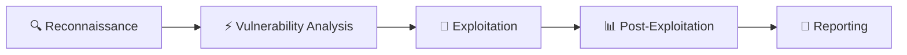

```markdown
<div align="center">

# 👤 HackfutSecRoot

### Offensive Security Specialist & Penetration Tester

<!-- MAIN BANNER -->
<p align="center">
  
</p>

<!-- BADGES -->
<p align="center">
  
  
  
  
  
</p>

<!-- STATS -->
<p align="center">
  
  
  
</p>

<!-- DESCRIPTION -->
<h3>
  ⚡ Security is an illusion, knowledge is power ⚡
</h3>

</div>

---

## 📖 Table of Contents

- [🚀 About Me](#-about-me)
- [🛠️ Skills](#️-skills)
- [🔥 Main Projects](#-main-projects)
- [📢 Communities & Channels](#-communities--channels)
- [📚 Resources](#-resources)
- [📱 Contact](#-contact)
- [⚠️ Disclaimer](#️-disclaimer)

---

## 🚀 About Me

<div align="center">

### Offensive Security & Penetration Testing

**HackfutSecRoot** is specialized in **offensive security** and **penetration testing**. Passionate about discovering vulnerabilities and exploiting systems.



</div>

---

---

## 🔥 Main Projects

<div align="center">

| Project | Description | Status |
|---------|-------------|--------|
| 🔴 **Exploit-Toolkit** | Advanced exploitation tools collection |  |
| 🟠 **Auto-Recon** | Automated reconnaissance framework |  |
| 🟢 **Payload-Generator** | Custom payload generator |  |

</div>

---

## 📢 Communities & Channels

<div align="center">

### Join Our Communities

<p align="center">
  <a href="https://t.me/+gsrpvshwGUc5MzI0">
    
  </a>
  <a href="https://t.me/LinxProdXs404">
    
  </a>
  <a href="https://t.me/ulp_Linxprodx">
    
  </a>
</p>

</div>

---

## 📚 Resources

<div align="center">

<p align="center">
  <a href="https://pastebin.com/u/hackfut">
    
  </a>
</p>

</div>

---

## 📱 Contact

<div align="center">

<p align="center">
  <a href="https://github.com/HackfutSecRoot">
    
  </a>
  <a href="https://t.me/+gsrpvshwGUc5MzI0">
    
  </a>
  <a href="https://pastebin.com/u/hackfut">
    
  </a>
</p>

</div>

---

## ⚠️ Disclaimer

<div align="center">

**All content is for educational purposes only.**

The use of tools and techniques presented here must be done in a legal and authorized framework. The author is not responsible for any misuse of the information provided.

</div>

---

<div align="center">

**© 2026 HackfutSecRoot** | *Stay curious, stay ethical*

</div>

```
